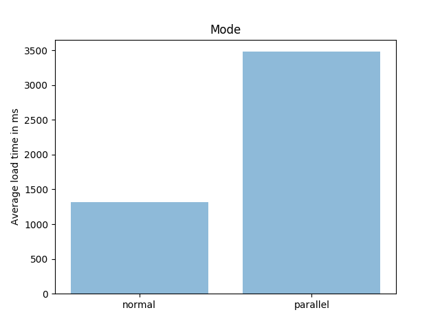
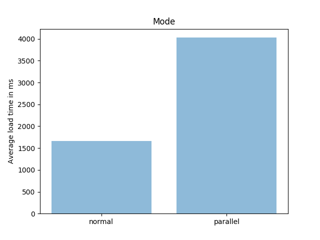
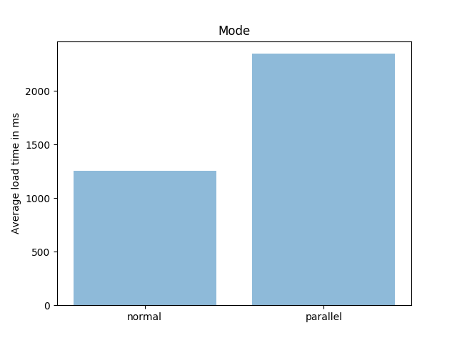
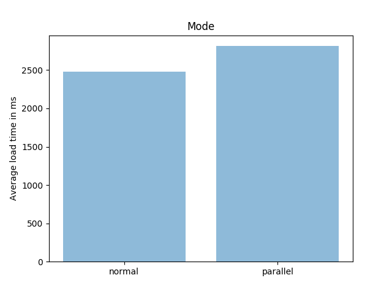

# Neo4j Cypher projections parallel loading test

I used the Social Network: Reddit Hyperlink Network available at http://snap.stanford.edu/data/soc-RedditHyperlinks.html

Graph properties:

   - multigraph(more than one relationship possible between a pair of nodes)
   - nodes: 55,863
   - relationships: 858,490

# Schema

```
CREATE CONSTRAINT ON (s:Subreddit) ASSERT s.id IS UNIQUE;
```

# Import
```
USING PERIODIC COMMIT 10000
LOAD CSV WITH HEADERS FROM "file:///soc-redditHyperlinks-title.tsv" as row FIELDTERMINATOR "\t"
MERGE (s:Subreddit{id:row.SOURCE_SUBREDDIT})
MERGE (t:Subreddit{id:row.TARGET_SUBREDDIT})
CREATE (s)-[:LINK{post_id:row.POST_ID,
link_sentiment:toInteger(row.LINK_SENTIMENT),
date:localDateTime(replace(row['TIMESTAMP'],' ','T'))}]->(t)
```
# Run test
```
python3 test_parallel.py 
```
# Results

Used tests:100 on a 16GB RAM, 4 CPU laptop, batchSize: 100_000

## Single rel

Relationships projected: 571927

Relationship query:

```
MATCH (s1:Subreddit)-[r:LINK]->(s2:Subreddit)
RETURN id(s1) as source, id(s2) as target
```

### Chart:


## Agg rel

Relationships projected: 234792

Relationship query:

```
MATCH (s1:Subreddit)-[r:LINK]->(s2:Subreddit)
RETURN id(s1) as source, id(s2) as target, count(*) as weight
```

### Chart:



## Agg Filter rel

Relationships projected: 221593

Relationship query:

```
MATCH (s1:Subreddit)-[r:LINK]->(s2:Subreddit)
WHERE r.link_sentiment = 1
RETURN id(s1) as source, id(s2) as target, count(*) as weight
```

### Chart:



## Agg Date rel

Relationships projected: 98454

Relationship query:

```
MATCH (s1:Subreddit)-[r:LINK]->(s2:Subreddit)
WHERE r.date.year = 2016
RETURN id(s1) as source, id(s2) as target, count(*) as weight
```

### Chart:



## Agg Date Filter rel

Relationships projected: 92428

Relationship query:

```
MATCH (s1:Subreddit)-[r:LINK]->(s2:Subreddit)
WHERE r.date.year = 2016 AND r.link_sentiment= 1
RETURN id(s1) as source, id(s2) as target, count(*) as weight
```

### Chart:

